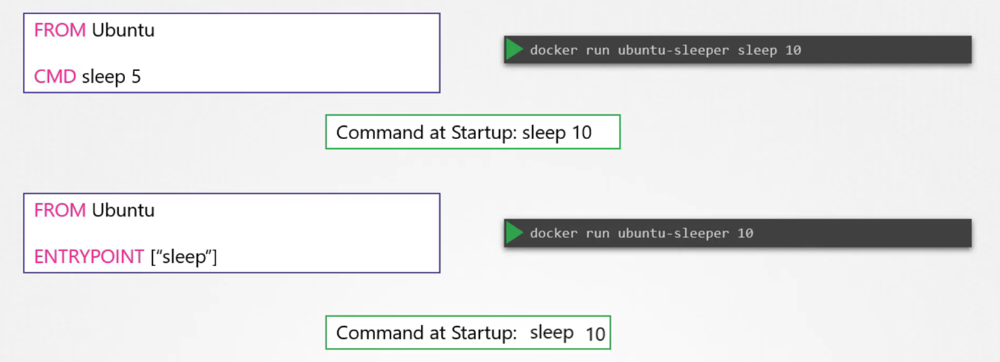

# Commands and Arguments in Docker
  - Take me to [Video Tutorial](https://kodekloud.com/topic/commands-and-arguments-in-docker/)
  
In this section, we will take a look at commands and arguments in docker

- To run a docker container
  ```
  $ docker run ubuntu
  ```
- To list running containers
  ```
  $ docker ps 
  ```
- To list all containers including that are stopped
  ```
  $ docker ps -a
  ```
  
  
  
#### Unlike virtual machines, containers are not meant to host operating system.
- Containers are meant to run a specific task or process such as to host an instance of a webserver or 
application server or a database server etc.

- Il container è in esecuzione fintantoché il comando è in esecuzione.


  
  
  
#### How do you specify a different command to start the container?
- One Option is to append a command to the docker run command and that way it overrides the default command specified
within the image.
  ```
  $ docker run ubuntu sleep 5
  ```
- This way when the container starts it runs the sleep program, waits for 5 seconds and then exists. 
How do you make that change permanent?
  
  
  
- There are different ways of specifying the command either the command simply as is in a shell form or in a JSON array format.
 
  
  
- Now, build the docker image
  ```
  $ docker build -t ubuntu-sleeper .
  ```
- Run docker container
  ```
  $ docker run ubuntu-sleeper
  ```
  
  
  
## Entrypoint Instruction
- The entrypoint instruction is like the command instruction as in you can specify the program that will be run 
when the container starts and whatever you specify on the command line.

- La differenza è che quando lancio un container con un CMD impostato, il comando che passo, va a sovrascrivere interamente
il parametro CMD, al contrario, quando specifico l'ENTRYPOINT e lancio il container con un parametro, non vado a 
sovrascrivere il comando, ma appendo il parametro al comando specificato e di default (che è quello specificato
nell'entrypoint)
- Per specificare un parametro di default, mi basta inserire la keyword CMD nel Dockerfile e questa verrà sovrascritta
quando eseguo il container da riga di comando aggiungendo qualcosa al fondo
- Per modificare l'entrypoint in docker, basta utilizzare il parametro --entrypoint

Quindi:



#### K8s Reference Docs
- https://docs.docker.com/engine/reference/builder/#cmd
