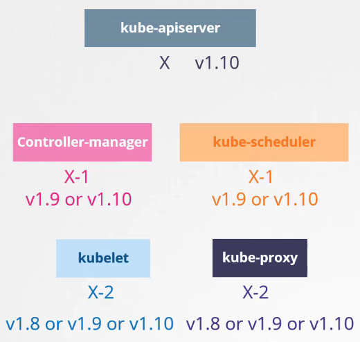

# Cluster Upgrade Introduction
  - Take me to [Video Tutorial](https://kodekloud.com/topic/cluster-upgrade-introduction/)
  
#### Is it mandatory for all of the kubernetes components to have the same versions?
- No, The components can be at different release versions.

Dal momento che il kube-apiserver è quello che utilizza e chiama gli altri componenti, gli altri componenti
non possono avere una versione maggiore di quella dell'api server stesso

In generale:
- controller-manager e kube-scheduler, possono avere una versione meno dell'api-server
- kubelet e kube-proxy possono avere anche 2 versioni meno dell'api-server


  
#### At any time, kubernetes supports only up to the recent 3 minor versions
- The recommended approach is to upgrade one minor version at a time.
  
  
  
#### Options to upgrade k8s cluster
 
  

In questa lezione, fa vedere come farlo tramite kubeadm  

**In linea pratica, quando devi farlo, vai nella documentazione e vedi i comandi da lanciare per effettuare prima 
l'update dei nodi master e poi l'upgrade dei nodi worker**

Naturalmente, come fa vedere nella demo e come presente nella doc, dipende dal gestore di pacchetti che hai.
Meglio copia incollare i comandi, che son simili ma non identici a questi 
## Upgrading a Cluster
- Upgrading a cluster involves 2 major steps
  - upgrade dei master node - quando il master è giù, non hai il controlplane, quindi anche con kubectl, non 
  riesci a fare nulla e se un Pod cade, non viene ritirato su, p.es., ma l'operatività dei worker garantisce che il
  traffico continui a funzionare. **Probabilmente, facendo upgrade di un master alla volta, il sistema non perde mai
  il controlplane**
  - upgrade dei worker node
  
#### There are different strategies that are available to upgrade the worker nodes
- One is to upgrade all at once. But then your pods will be down and users will not be able to access the applications.
  
- Second one is to upgrade one node at a time. 
 
- Third one would be to add new nodes to the cluster, in pratica qua ne tiriamo uno via, quello vecchio e aggiungiamo
quello nuovo, che è appunto un descrittore del nodo

  
## kubeadm - Upgrade master node


Come si può vedere, ti fornisce le versioni attualmente installate e ti dice a quali verranno portate, ossia alle 
ultime stabili. **Ciò che aggiorna è la controlplane**, quindi: 
- api server
- controller manager
- scheduler 
- kube-proxy

**Come già detto, kubelet non viene aggiornato, così come CoreDNS e Etcd**

- kubeadm has an upgrade command that helps in upgrading clusters. **Non aggiorna kubelet**
  ```
  $ kubeadm upgrade plan
  ```
  

**Naturalmente dipende da che gestore di pacchetti hai, può essere apt-get o può essere yum, p.es.**  

- Upgrade kubeadm from v1.11 to v1.12
  ```
  $ apt-get upgrade -y kubeadm=1.12.0-00
  ```
- Upgrade the cluster (
  ```
  $ kubeadm upgrade apply v1.12.0
  ```
  
- If you run the 'kubectl get nodes' command, you will see the older version. 
This is because in the output of the command it is showing the versions of kubelets on each of these nodes 
registered with the API Server and not the version of API Server itself  
  ```
  $ kubectl get nodes
  ```
  
  
  
- Upgrade 'kubelet' on the master node - **non necessariamente c'è un processo kubelet nei master node**
  ```
  $ apt-get upgrade kubelet=1.12.0-00
  ```
- Restart the kubelet
  ```
  $ systemctl restart kubelet
  ```
- Run 'kubectl get nodes' to verify
  ```
  $ kubectl get nodes
  ```
  
  
 
## kubeadm - Upgrade worker nodes
  
- From master node, run 'kubectl drain' command to move the workloads to other nodes
  ```
  $ kubectl drain node-1
  ```
- Upgrade kubeadm and kubelet packages
  ```
  $ apt-get upgrade -y kubeadm=1.12.0-00
  $ apt-get upgrade -y kubelet=1.12.0-00
  ```
- Update the node configuration for the new kubelet version
  ```
  $ kubeadm upgrade node config --kubelet-version v1.12.0
  ```
  **Nella doc attuale** (https://kubernetes.io/docs/tasks/administer-cluster/kubeadm/upgrading-linux-nodes/), il comando
eseguito è solo `sudo kubeadm upgrade node`

- Restart the kubelet service
  ```
  $ systemctl restart kubelet
  ```
- Mark the node back to schedulable
  ```
  $ kubectl uncordon node-1
  ```
  
  
  
- Upgrade all worker nodes in the same way

  
  

#### Demo Video on [Cluster Upgrade](https://kodekloud.com/topic/demo-cluster-upgrade/)

#### K8s Reference Docs
- https://kubernetes.io/docs/tasks/administer-cluster/kubeadm/kubeadm-upgrade/
- https://kubernetes.io/docs/reference/setup-tools/kubeadm/kubeadm-upgrade/

In linea pratica, quando devi farlo, vai nella documentazione e vedi i comandi da lanciare per effettuare prima 
l'update dei nodi master e poi l'upgrade dei nodi worker
  