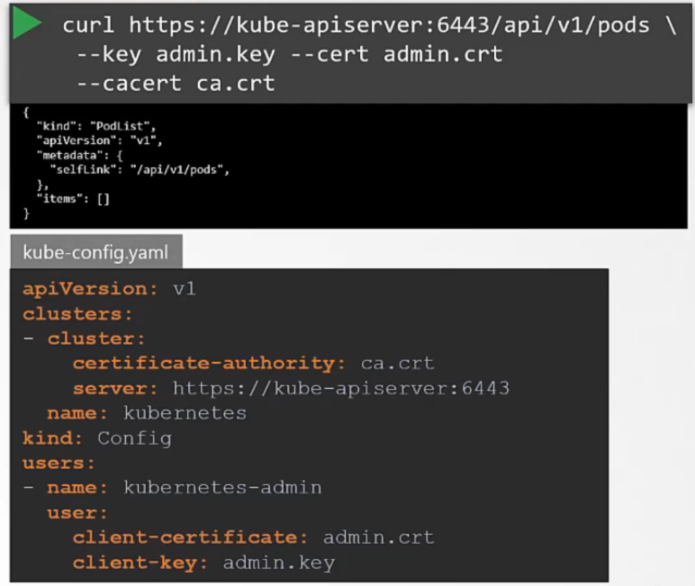

# TLS in kubernetes - Certificate Creation
  - Take me to [Video Tutorial](https://kodekloud.com/topic/tls-in-kubernetes-certificate-creation/)
  
In this section, we will take a look at TLS certificate creation in kubernetes

## Generate Certificates
- There are different tools available such as easyrsa, openssl or cfssl etc. or many others for generating certificates.
- Noi utilizzeremo openssl

## Certificate Authority (CA)

- Generate Keys
  ```
  $ openssl genrsa -out ca.key 2048
  ```
- Generate CSR (Certificate Signin Request)
  ```
  $ openssl req -new -key ca.key -subj "/CN=KUBERNETES-CA" -out ca.csr
  ```
- Sign certificates
  ```
  $ openssl x509 -req -in ca.csr -signkey ca.key -out ca.crt
  ```
 
 
 
## Generating Client Certificates

#### Admin User Certificates

- Generate Keys
  ```
  $ openssl genrsa -out admin.key 2048
  ``` 
- Generate CSR (Certificate Signin Request)
  ```
  $ openssl req -new -key admin.key -subj "/CN=kube-admin" -out admin.csr
  ```
  CN è il nome utente che verrà poi utilizzato dall'utente per loggarsi su k8s 

- Sign certificates with the CA keys pair - Infatti passiamo -CA e -CA.key, perché la stiamo firmando con le chiavi 
della CA, che lo rende valido all'interno del cluster. 

Questo è il certificato che l'admin utilizzerà per loggarsi sul cluster k8s

  ```
  $ openssl x509 -req -in admin.csr -CA ca.crt -CAkey ca.key -out admin.crt
  ```

In pratica possiamo vedere questo processo come una sorta di creazione di username e password, dove il certificato
è la username validata e la password è la chiave, solo è molto più sicuro

  
  
- Certificate with admin privilages, questo è il modo corretto per creare la CSR, aggiungendo all'utente admin,
l'appartenenza al gruppo system:masters

  ```
  $ openssl req -new -key admin.key -subj "/CN=kube-admin/O=system:masters" -out admin.csr
  ```
  
Questo è il modo in cui possiamo utilizzare certificato e chiave, più comodo logicamente aggiungerlo al file di 
configurazione `kube-config.yaml`, che è il file di configurazione

Per verificare il chiamante, è sempre necessario avere il certificato della CA, che è lo stesso motivo per cui i 
certificati delle principali CA son installate nel browser di default


  
#### We follow the same procedure to generate client certificate for all other components that access the kube-apiserver.

  
  
  
  
  
   
  
  
## Generating Server Certificates

## ETCD Server certificate

Qua è importante specificare anche i peer certificates

  
  
  
  
## Kube-apiserver certificate

Generiamo questo certificato con una serie di subject alternatives names, come `kubernetes`, `kubernetes.default`, 
`kubernetes.default.svc` o `kubernetes.default.svc.cluster.local` oltre al `kube-apiserver`

Questi son messi in un file di configurazione di openssl, nella relativa sezione

  
  
  

Come si vede, ci sono i vari parametri di (dall'alto verso il basso):
- certificato della CA (per verificare le chiamate che arrivano da etcd, CA con cui è firmato il suo certificato)
- certificato e chiave per connettersi ad etcd (mutua autenticazione con etcd, ossia quando etcd chiede ad api 
server il certificato, certificato utilizzato da apiserver per autenticarsi come client quando chiama etcd, 
quando etcd lo vuole identificare come client)
- certificato della CA (per verificare le chiamate che arrivano da kubelet, CA con cui è firmato il suo certificato)
- certificato e chiave per connettersi ad kubelet (mutua autenticazione con kubelet, certificato utilizzato da apiserver 
per autenticarsi come client quando chiama kubelet, quando kubelet lo vuole identificare come client)
- certificato della CA con cui è firmato il certificato dell'api server
- certificato e chiave dell'api server
  
## Kubectl Nodes (Server Cert)

Questo è il server HTTPs esposto su tutti i nodi workder per gestire il nodo ed è chiamato dall'API Server.

Un certificato per ogni nodo

   
   
## Kubectl Nodes (Client Cert)

Certificati dei vari kubelet, nei nodi worker, che comunicano e si autenticano con il kube api server, in questo
caso sono loro che iniziano la comunicazione. Un certificato per ogni nodo.

Ogni nodo ha il suo, in maniera tale che si identifica ed eventualmente possiamo fornigli delle permission differenti.

   
   
   
   
  
  

  

  


  
  
  
  
 
