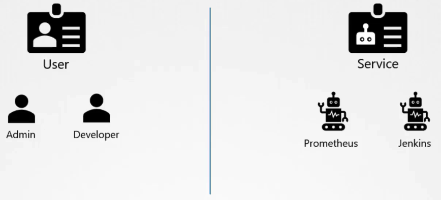

# Service Accounts

## service accounts and accounts

- Account: utilizzati da umani
- Service Accounts: utilizzati da macchine (Jenkins, Prometheus) per deployare applicazioni nel cluster k8s
o per poter agire nel cluster (p.es. chiamare l'api server, autenticarsi ecc ecc)



## service accounts commands and usage

Soliti comandi di `create`, `get` e `describe` `serviceaccount` o `sa`

- Quando creiamo un serviceaccount, viene creato un token, che viene usato dal service account per autenticarsi
nell'api server
  - il token, creato all'atto della creazione del sa, è storato come secret e legato al service account creato
  - per vederlo, basta usare il solito comando describe
  - il token è un authentication Bearer token


Quello che puoi fare è: 
- creare il SA
- tramite RBAC associarci i giusti permessi
- montarlo come volume nel Pod che lo utilizza

## Default service account

Quello che succede è che, per ogni namespace creato, viene creato un secret di default, chiamato appunto default. 
Il relativo token Bearer creato, viene montato come volume in ogni Pod che viene creato in quel namespace.

Il token default è ristretto e può effettuare solo operazioni di lettura nell'api server.

Nel mount del volume, vedrai il secret montato come 3 differenti file, il CRT, un file namespace e un file token, 
che è l'effettivo Bearer token. Da dentro il Pod, il token è in chiaro.

La location di default dove è montato il secret è `/var/run/secrets/kubernetes.io/serviceaccount`

## Impostazione service account sul Pod

Per impostare il service account su un Pod o su un Deployment, è necessario impostare il valore `spec.serviceAccount'. 

Questa operazione non si può fare a caldo e perché sia effettiva, è necessario distruggere e ricreare il Pod
Naturalmente, nel caso del Deployment, è necessario aggiungere in `spec.template.serviceAccount`.

Quando si imposta un nuovo serviceAccount, automaticamente, a meno di specificare `automountServiceAccountToken` a false,
viene montanto il secret come volume nel Pod.

## update dalle 1.22

Dalla 1.22, è stato introdotta la `TokenRequestAPI` all'interno del Cluster k8s, per far si che i token creati nel
cluster, siano: 
- Audience Bound
- Time Bound (hanno una expire date)
- Object Bound

e la creazione è delegata alla `TokenRequestAPI`

In generale più scalabili.

Ora quando viene creato un service account, viene generato un nuovo secret, con un tempo prestabilito, 
e quindi non di durata uguale alla durata del service account (e del token associato)

**Inoltre non è montato come volume, ma è montato come projected volume e quindi parla con il TokenRequestAPI, che 
lo aggiorna automaticamente sotto il culo del Pod **

## update dalle 1.24

Dalla 1.24, alla creazione del service account, non viene più creato il relativo token, ma è necessario esplicitamente
richiederne la creazione e in quel caso, è associato a quel service account.

Si crea tramite il comando:

```
k create token <service-account-name>
```

che ne printa anche il token (già pronto), con una expire date (default 1 ora)

