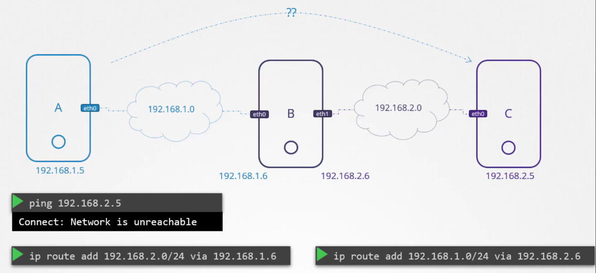

# Pre-requisite Switching Routing Gateways

  - Take me to [Lecture](https://kodekloud.com/topic/pre-requisite-switching-routing-gateways-cni-in-kubernetes/)

In this section, we will take a look at **Switching, Routing and Gateways**

Switch -> stessa rete, interfacce di rete della singola macchina
Routing -> connessione fra reti differenti tramite router
Gateway -> default route nella routing table

## Switching

- To see the interface on the host system:
```
$ ip link
```

- To see the IP Addresses assigned to those interfaces on the local host
```
$ ip addr
```


## Routing

- To see the existing routing table on the host system.

```
$ route
```
```
$ ip route show
or
$ ip route list
```

- To add entries into the routing table.

```
$ ip route add 192.168.1.0/24 via 192.168.2.1

```
Basterebbe anche aggiungere il router di default in questa casistica:

```
$ ip route add default via 192.168.2.1
```
magari p.es. la router di default potrebbe esser quella che va su internet

Questo permette alla rete di sinistra, di raggiungere quella di destra passando
per il router, che connette la rete 192.168.2.0 con la rete 192.168.1.0.

Mentre lo switch permette di connettere due device della stessa rete, 
il router è un device intelligente che permette di connettere reti differenti

**Preso dalla doc man di ip route add, non è dell'immagine sotto:**
`ip route add default via 192.168.1.1 dev eth0`

Adds a default route (for all addresses) via the local gateway 192.168.1.1 that can be reached 
on device eth0 (nell'interfaccia eth0, visibile tramite `ip link`), cioè è il default router.


## Gateways

- To add a default route.
```
$ ip route add default via 192.168.2.1
```

Se p.es. utilizziamo una macchina per connetterne due, come se agisse da router, bisogna ricordarsi di 
attivare l'IP forwarding sull'interfaccia della macchina router, che di default è disattivata per questioni di sicurezza



- To check the IP forwarding is enabled on the host.
```
$ cat /proc/sys/net/ipv4/ip_forward
0

$ echo 1 > /proc/sys/net/ipv4/ip_forward
```

- Enable packet forwarding for IPv4.
```
$ cat /etc/sysctl.conf

# Uncomment the line
net.ipv4.ip_forward=1
```

- To view the sysctl variables.
```
$ sysctl -a 
```

- To reload the sysctl configuration.
```
$ sysctl --system
```


