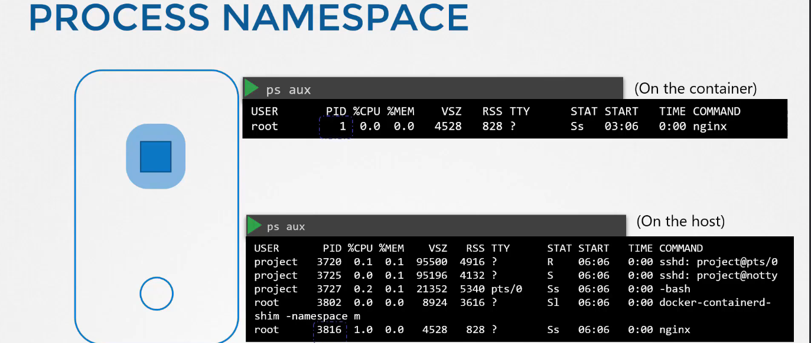
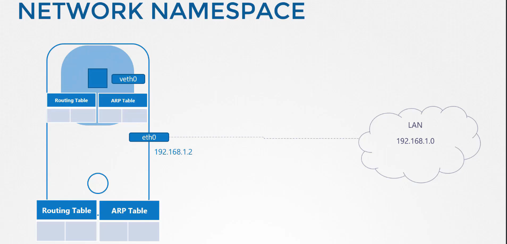
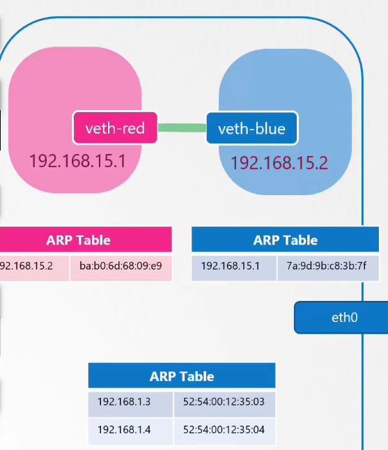
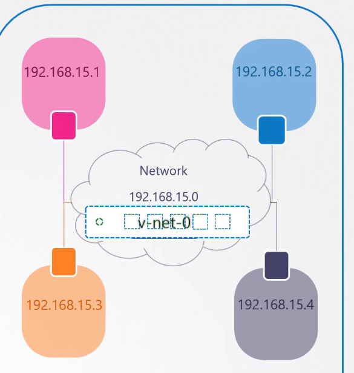
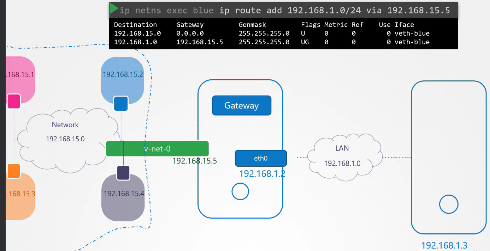

# Pre-requisite Network Namespaces

  - Take me to [Lecture](https://kodekloud.com/topic/prerequsite-network-namespaces/)

In this section, we will take a look at **Network Namespaces**

Interessante che se hai un'interfaccia di rete, ci assegni un IP e lo aggiungi alla route table
per connettere le reti.

Le reti dell'host dei vari network namespaces son separate, si possono connettere tramte Bridge e 
modifica delle routing table, associando le interfacce ad IP e modificando le routing tables.


## Process Namespace

> On the container
```
$ ps aux      
```

> On the host
```
$ ps aux 

```



E' lo stesso processo, solo associato a differenti PID. All'interno del container, vedo solo quel processo,
nell'host, come root, li vedo tutti

## Network Namespace

```
$ route
```

```
$ arp
```



**Come vedi, il container ha le sue network interfaces, routing table e ARP Table, non vede quelle dell'host.**

## Create Network Namespace

Questo è quello che avviene quando creiamo un Container, creiamo un nuovo network namespace.

```
$ ip netns add red

$ ip netns add blue
```
- List the network namespace

```
$ ip netns
```

## Exec in Network Namespace

- List the interfaces on the host

```
$ ip link
```

**- Exec inside the network namespace the ip link command, prefixed  by `ip netns exec <network-namespace>`**
  - questo vale anche per altri comandi, come arp, p.es.

```
$ ip netns exec red ip link
1: lo: <LOOPBACK> mtu 65536 qdisc noop state DOWN mode DEFAULT group default qlen 1000
    link/loopback 00:00:00:00:00:00 brd 00:00:00:00:00:00

$ ip netns exec blue ip link
1: lo: <LOOPBACK> mtu 65536 qdisc noop state DOWN mode DEFAULT group default qlen 1000
    link/loopback 00:00:00:00:00:00 brd 00:00:00:00:00:00
```
- You can try with other options as well. Both works the same.
```
$ ip -n red link
1: lo: <LOOPBACK> mtu 65536 qdisc noop state DOWN mode DEFAULT group default qlen 1000
    link/loopback 00:00:00:00:00:00 brd 00:00:00:00:00:00
```

## ARP and Routing Table

Le tabelle ARP, son le tabelle di connessione dell'indirizzo IP con l'indirizzo di rete, di livello 2.
Anche queste son separate fra container e host.
- eseguiamo sempre il command con `ip netns exec <network-namespace> <command>`

Il comando route, naturalmente restituisce le tabelle di routing

> On the host
```
$ arp
Address                  HWtype  HWaddress           Flags Mask            Iface
172.17.0.21              ether   02:42:ac:11:00:15   C                     ens3
172.17.0.55              ether   02:42:ac:11:00:37   C                     ens3
```

> On the Network Namespace
```
$ ip netns exec red arp
Address                  HWtype  HWaddress           Flags Mask            Iface

$ ip netns exec blue arp
Address                  HWtype  HWaddress           Flags Mask            Iface
```

> On the host 
```
$ route
```

> On the Network Namespace
```
$ ip netns exec red route
Kernel IP routing table
Destination     Gateway         Genmask         Flags Metric Ref    Use Iface

$ ip netns exec blue route
Kernel IP routing table
Destination     Gateway         Genmask         Flags Metric Ref    Use Iface
```

## Virtual Cable

Tramite un virtual cable, siamo in grado di connettere due reti virtuali o network namespace

- To create a virtual cable e connettere quindi le due reti, creiamo i due ingressi (veth-red e veth-blue)
```
$ ip link add veth-red type veth peer name veth-blue
```

- Quello che dobbiamo poi fare è assegnare veth-blue e veth-red ai due network namespaces.
- To attach with the network namespaces
```
$ ip link set veth-red netns red

$ ip link set veth-blue netns blue
```

- Assegniamo quindi un indirizzo IP alle interfacce all'interno del network namespace. To add an IP address
```
$ ip -n red addr add 192.168.15.1/24 dev veth-red

$ ip -n blue addr add 192.168.15.2/24 dev veth-blue
```

- To turn it up `ns` interfaces
```
$ ip -n red link set veth-red up

$ ip -n blue link set veth-blue up
```

- Check the reachability 
```
$ ip netns exec red ping 192.168.15.2
PING 192.168.15.2 (192.168.15.2) 56(84) bytes of data.
64 bytes from 192.168.15.2: icmp_seq=1 ttl=64 time=0.035 ms
64 bytes from 192.168.15.2: icmp_seq=2 ttl=64 time=0.046 ms

$ ip netns exec red arp
Address                  HWtype  HWaddress           Flags Mask            Iface
192.168.15.2             ether   da:a7:29:c4:5a:45   C                     veth-red

$ ip netns exec blue arp
Address                  HWtype  HWaddress           Flags Mask            Iface
192.168.15.1             ether   92:d1:52:38:c8:bc   C                     veth-blue

```



Chiaramente i virtual cable, le connessioni effettuate fra network namespaces, sono trasparenti per l'host.

- Delete the link.
```
$ ip -n red link del veth-red
```

> On the host
```
# Not available
$ arp
Address                  HWtype  HWaddress           Flags Mask            Iface
172.16.0.72              ether   06:fe:61:1a:75:47   C                     ens3
172.17.0.68              ether   02:42:ac:11:00:44   C                     ens3
172.17.0.74              ether   02:42:ac:11:00:4a   C                     ens3
172.17.0.75              ether   02:42:ac:11:00:4b   C                     ens3
```

## Linux Bridge

Con questa soluzione, possiamo far comunicare diverse network namespaces insieme, non solo 2, è in pratica
un brigde per far parlare diverse reti.

- Create a network namespace

```
$ ip netns add red

$ ip netns add blue
``` 
- To create a internal virtual bridge network, we add a new interface to the host, lo chiamiamo `v-net-0`
```
$ ip link add v-net-0 type bridge
```
- Display in the host
```
$ ip link
8: v-net-0: <BROADCAST,MULTICAST> mtu 1500 qdisc noop state DOWN mode DEFAULT group default qlen 1000
    link/ether fa:fd:d4:9b:33:66 brd ff:ff:ff:ff:ff:ff
```
- Currently it's down, so turn it up
```
$ ip link set dev v-net-0 up
```
- To connect network namespace to the bridge. Creating a virtual cable (come naming convention, un lato 
lo chiamiamo veth-red e **all'altro lato, gli aggiungiamo -br, per ricordarci che è un bridge **)
```
$ ip link add veth-red type veth peer name veth-red-br

$ ip link add veth-blue type veth peer name veth-blue-br
```
- Set with the network namespaces, aggiungiamo i cavi ai namespaces
```
$ ip link set veth-red netns red

$ ip link set veth-blue netns blue

$ ip link set veth-red-br master v-net-0

$ ip link set veth-blue-br master v-net-0
```
- To add an IP address
```
$ ip -n red addr add 192.168.15.1/24 dev veth-red

$ ip -n blue addr add 192.168.15.2/24 dev veth-blue
```
- To turn it up `ns` interfaces
```
$ ip -n red link set veth-red up

$ ip -n blue link set veth-blue up

```

Arriviamo quindi a questa topologia (facendo anche per le altre network namespaces):



Il mio host è su una rete e le network namespaces son su un'altra network.

> On the host (not able to connect) 
```
$ ping 192.168.15.1
```

> On the ns
```
$ ip netns exec blue ping 192.168.1.1
Connect: Network is unreachable

$ ip netns exec blue route

$ ip netns exec blue ip route add 192.168.1.0/24 via 192.168.15.5

```

Volendo le possiamo connettere, possiamo connettere il brigde, che è un'interfaccia di rete, con la rete dell'host, 
dando un indirizzo IP all'interfaccia del bridge: 

```
$ ip addr add 192.168.15.5/24 dev v-net-0

```
e siamo in grado di pingare dall'host uno dei network namespaces: 

```
$ ping 192.168.15.1
```

Possiamo anche far si che la network namespace comunichi, tramite la v-net-0, il bridge 192.168.15.5, 
con il mondo esterno, con la rete dell'host, gestendo la route table
```
ip netns exec blue ip route add 192.168.1.0/24 via 192.168.15.5
```



A questo punto siamo in grado di pingare, senza ricevere risposte, per questo
dobbiamo attivare il nat, per far si che chiunque riceva i nostri pacchetti pensi che stiamo inviando i 
pacchetti dalla rete dell'host e non dal network namespaces

```
$ ip netns exec blue ping 192.168.1.1
PING 192.168.1.1 (192.168.1.1) 56(84) bytes of data.

$ iptables -t nat -A POSTROUTING -s 192.168.15.0/24 -j MASQUERADE

$ ip netns exec blue ping 192.168.1.1

$ ip netns exec blue ping 8.8.8.8

$ ip netns exec blue route

# questo ci permette fondamentalmente di raggiungere p.es. il DNS di google e ogni indirizzo che l'host raggiunge
$ ip netns exec blue ip route add default via 192.168.15.5

$ ip netns exec blue ping 8.8.8.8
```

- Adding port forwarding rule to the iptables

```
$ iptables -t nat -A PREROUTING --dport 80 --to-destination 192.168.15.2:80 -j DNAT
```
```
$ iptables -nvL -t nat
```


