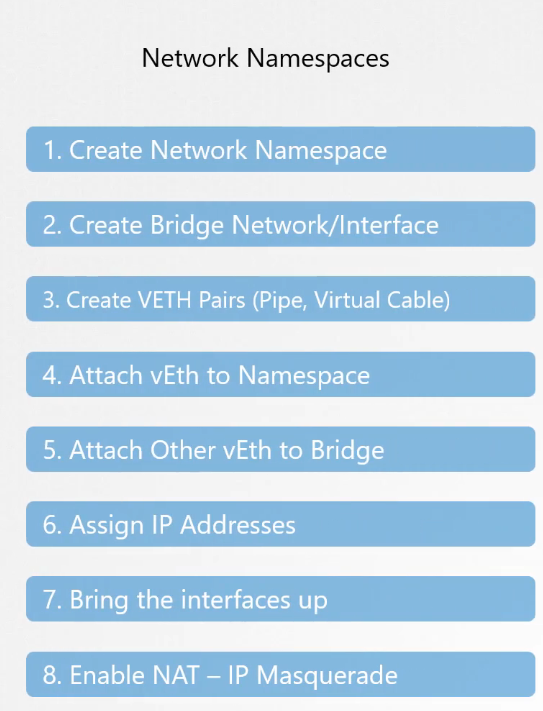
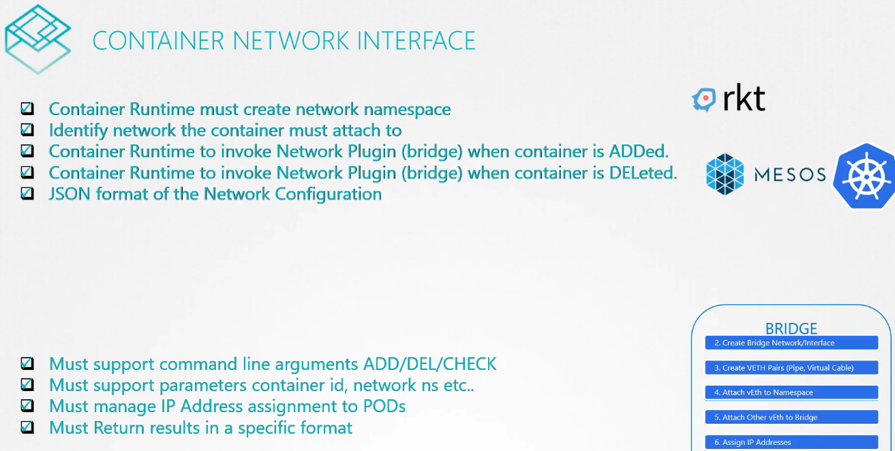

# Pre-requisite CNI

  - Take me to [Lecture](https://kodekloud.com/topic/prerequsite-cni/)


Quello che abbiamo visto finora, son queste fasi: 



Ogni sistema che implementa una network solution, deve risolvere le stesse problematiche ed è per questo che è
stata definita una CNI che definisce una serie di responsabilità per i container runtime e i plugins.



I Container Runtime sono p.es. RKT, Docker, i plugins son la parte dove le parti comuni son implementate. 
Alla creazione del container, nel Container Runtime, chiamo l'add del modulo plugins, p.es., idem per la 
delete ecc ecc.

Ogni runtime dovrebbe esser in grado di esser eseguito con ogni plugin.

P.es. RKT è un runtime, Bridge è un plugin.
Docker non rispetta CNI.

All'esame, è possibile che si chieda di installare un network plugins.


## Third Party Network Plugin Providers

- [Weave](https://www.weave.works/docs/net/latest/kubernetes/kube-addon/#-installation)
- [Calico](https://docs.projectcalico.org/getting-started/kubernetes/quickstart)
- [Flannel](https://github.com/coreos/flannel/blob/master/Documentation/kubernetes.md)
- [Cilium](https://github.com/cilium/cilium)


## To view the CNI Network Plugins

- CNI comes with the set of supported network plugins. 

```
$ ls /opt/cni/bin/
bridge  dhcp  flannel  host-device  host-local  ipvlan  loopback  macvlan  portmap  ptp  sample  tuning  vlan
```


#### References Docs

- https://kubernetes.io/docs/concepts/extend-kubernetes/compute-storage-net/network-plugins/


