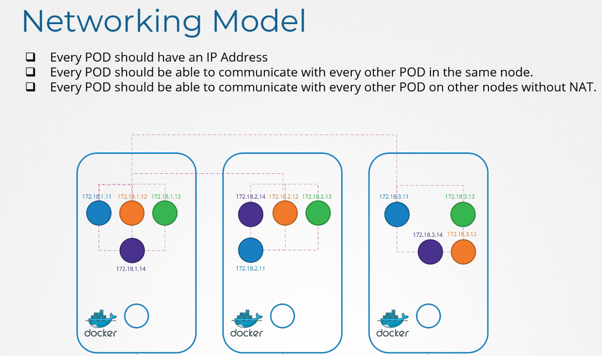
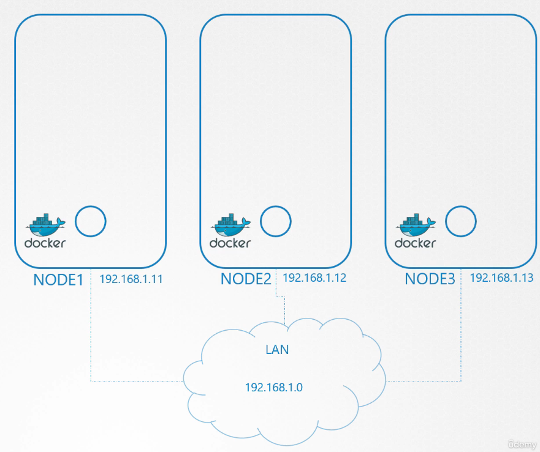
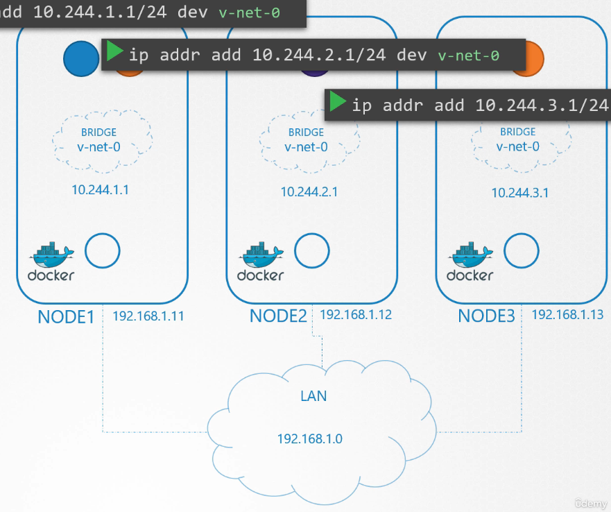
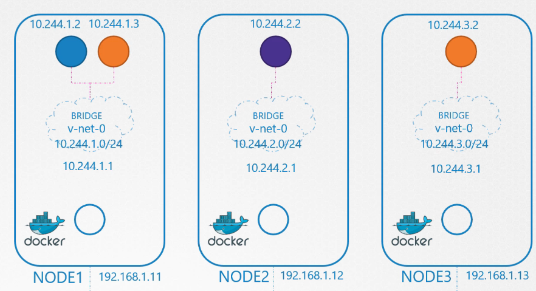
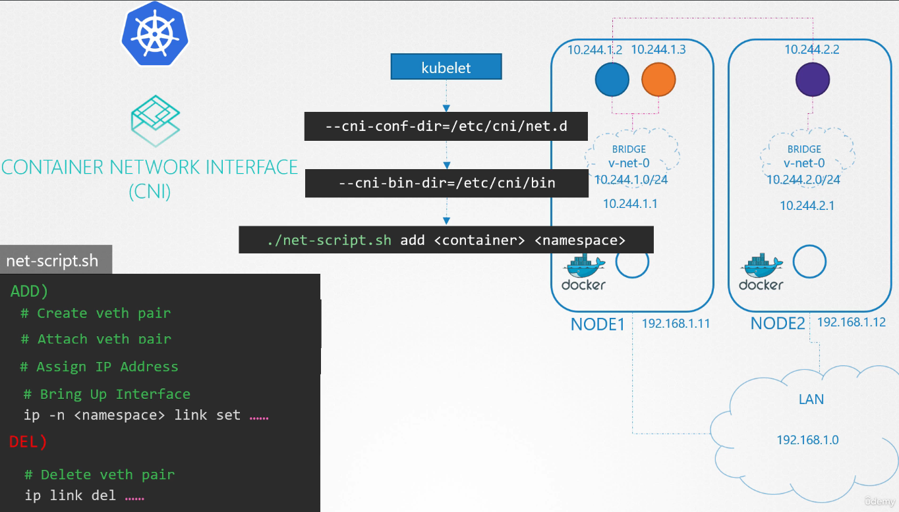

# Pod Networking

  - Take me to [Lecture](https://kodekloud.com/topic/pod-networking/)

In this section, we will take a look at **Pod Networking**

## Premesse

k8s non fornisce una soluzione  per far parlare i Pod, installi tu una networking solution (a quanto ho capito)
che rispondi ai requisiti forniti da k8s.

Questi sono i requisiti:




Ma conosciamo i principi di networking e la CNI, proviamo quindi prima a risolvere il problema da noi, senza 
networking solution:

Partiamo da questa soluzione:



Praticamente k8s quando parte, crea un network namespace (uno per container) sui vari nodi, poi crea la bridge network per far
comunicare i vari network namespace nel nodo, li attiva e fornisce un IP alle bridge interface



Dalla figura sopra, avviene quello che avviene alla creazione di ogni Container che è eseguito tramite uno script

- creazione del veth pair e attach un lato dal container e l'altro dal bridge
- assegnano un indirizzo IP all'interfaccia, ossia al Pod, e impostiamo il default gateway
  - l'indirizzo è un indirizzo nella subnet (10.244.1.2 p.es.)
- tiriamo su l'interfaccia quindi

Fatto per 2 container differenti, i 2 container possono comunicare fra loro nel nodo

**Abbiamo risolto il primo problema, i Pod hanno un indirizzo IP e possono comunicare fra loro nel Nodo**



I Pod logicamente di nodi diversi non son in grado di parlarsi, perché appartengono a subnet differenti, dobbiamo
quindi modificare la routing table, impostando la rotta verso quegli indirizzi (o subnet), passando per la l'interfaccia
che li porta alla LAN comune.

Vedi da inter node communication.


# intra node communication
- To add bridge network on each node

> node01
```
$ ip link add v-net-0 type bridge
```
> node02
```
$ ip link add v-net-0 type bridge
```

> node03
```
$ ip link add v-net-0 type bridge
```

- Currently it's down, turn it up.

> node01
```
$ ip link set dev v-net-0 up
```

> node02
```
$ ip link set dev v-net-0 up
```

> node03
```
$ ip link set dev v-net-0 up
```

- Set the IP Addr for the bridge interface

> node01
```
$ ip addr add 10.244.1.1/24 dev v-net-0
```

> node02
```
$ ip addr add 10.244.2.1/24 dev v-net-0
```

> node03
```
$ ip addr add 10.244.3.1/24 dev v-net-0
```


# inter node communication
- Controlliamo la connettività verso i Pod in un altro nodo, logicamente non riusciamo, dobbiamo creare la rotta
verso l'interfaccia di rete che dalla lan porta all'interfaccia di rete verso il nodo che contiene il Pod.

```
$ ping 10.244.2.2
Connect: Network is unreachable
```

- Add route in the routing table
```
$ ip route add 10.244.2.2 via 192.168.1.12
```

> node01
```
$ ip route add 10.244.2.2 via 192.168.1.12

$ ip route add 10.244.3.2 via 192.168.1.13
```

> node02
```
$ ip route add 10.244.1.2 via 192.168.1.11

$ ip route add 10.244.3.2 via 192.168.1.13

```

> node03
```
$ ip route add 10.244.1.2 via 192.168.1.11

$ ip route add 10.244.2.2 via 192.168.1.12
```

Questo funziona bene per setup semplici, ma chiaramente, è molto più complesso quando l'architettura si complica con
numerosi nodi. 

Logicamente una soluzione migliore di impostare le interfacce nel singolo nodo, è quella di impostare una router nella
network per far parlare reti differenti e far si che tutti i nodi utilizzino quello come default gateway.

- Add a single large network 


## Container Network Interface (CNI)



Fondamentalmente, CNI dice a k8s come eseguire lo script e dice anche come deve esser impostato lo script, lo script
è eseguito alla creazione\distruzione dei Pod e utilizza i comandi di rete di Unix per impostare le cose correttamente
ai vari eventi, secondo quanto definito da CNI. CNI definisce come abbiamo visto le responsabilità fra network solutions
e network plugins.

Quel che succede è che il kubelet, presente in ogni nodo si occupa del ciclo dei vita dei Pod, quindi li crea
e li distrugge. 

Quindi kubelet sa fondamentalmente dove si trova lo script cni che si occupa delle attività da effettuare alla 
creazione e distruzione di ogni Pod. Ogni Pod ha infatti una sezione ADD e una sezione DELete che kubelet 
esegue alla creazione\distruzione del Pod, insieme a quello che sono i parametri da passare.


#### References Docs

- https://kubernetes.io/docs/concepts/workloads/pods/