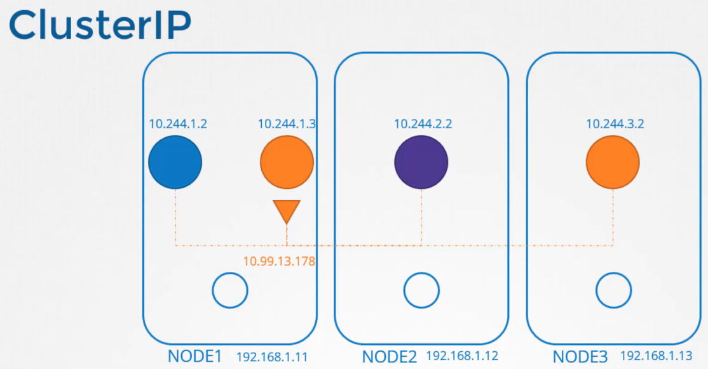
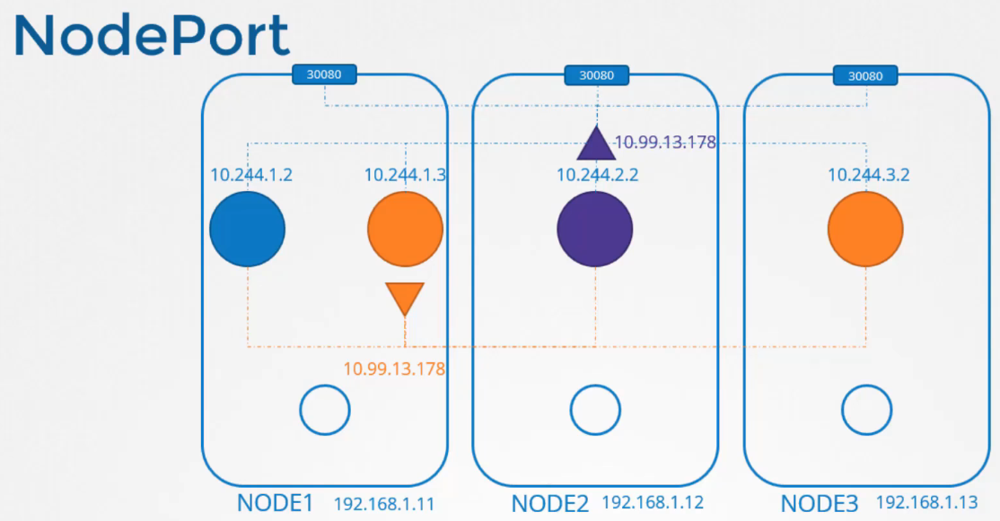
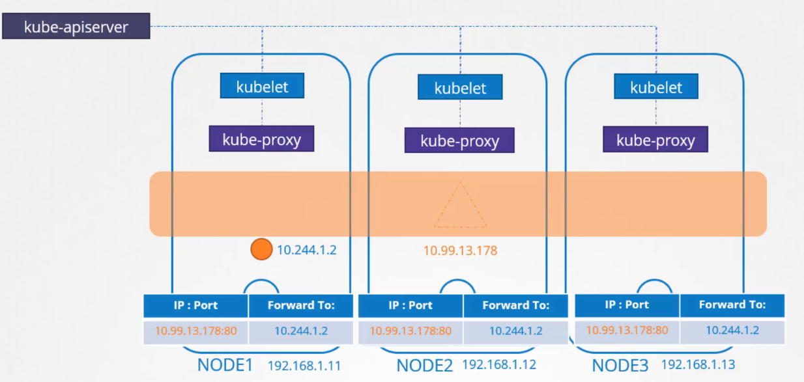

# Service Networking

  - Take me to [Lecture](https://kodekloud.com/topic/service-networking/)

In this section, we will take a look at **Service Networking**

## Service Types

- ClusterIP 

Il ClusterIP service è accessibile dall'interno del Cluster, ha un indirizzo differente, che non è 
legato ad una network di un particolare Nodo (appartiene ad una subnet differente
da quella dei Pod) ed è accessibile da tutti i Pod del Cluster.




```
clusterIP.yaml

apiVersion: v1
kind: Service
metadata:
  name: local-cluster
spec:
  ports:
  - port: 80
    targetPort: 80
  selector:
    app: nginx
```

- NodePort

Ha sempre un indirizzo IP di una subnet differente da quella dei Pod e stavolta è anche esposto su ogni Nodo, ossia
assegna una determinata porta al servizio e la espone su ogni Nodo.



```
nodeportIP.yaml

apiVersion: v1
kind: Service
metadata:
  name: nodeport-wide
spec:
  type: NodePort
  ports:
  - port: 80
    targetPort: 80
  selector:
    app: nginx
```

## Ciclo di vita dei servizi e kube-proxy

Il servizio di fatto non esiste, non è un oggetto come il Pod, che ha un'interfaccia e un IP, è un oggetto virtuale
e non è associato ad alcun nodo o namespace, ma è un oggetto cluster wide.

Nel nodo è presente un componente chiamato kube-proxy che è in ascolto rispetto a quel che accade nel kube-apiserver
rispetto alle modifiche di rete. 

Alla richiesta di creazione di un servizio al kube-apiserver, il kube-proxy in ascolto quel che fa è staccare un indirizzo
IP da un range predefinito (service-cluster-ip-range) e disgiunto da quello dei Pod e modificare le routing table relative 
alla rete a cui son connessi i vari Pod e quindi dire che alla chiamata all'IP:porta del service, bisogna andare verso 
il Pod o uno dei Pod in caso di repliche.

Idem agisce alla richiesta di distruzione di un service e così via.




## To create the service 

```
$ kubectl create -f clusterIP.yaml
service/local-cluster created

$ kubectl create -f nodeportIP.yaml
service/nodeport-wide created
```

## To get the Additional Information

```
$ kubectl get pods -o wide
NAME    READY   STATUS    RESTARTS   AGE   IP           NODE     NOMINATED NODE   READINESS GATES
nginx   1/1     Running   0          1m   10.244.1.3   node01   <none>           <no
```

## To get the Service

```
$ kubectl get service
NAME            TYPE        CLUSTER-IP      EXTERNAL-IP   PORT(S)        AGE
kubernetes      ClusterIP   10.96.0.1       <none>        443/TCP        5m22s
local-cluster   ClusterIP   10.101.67.139   <none>        80/TCP         3m
nodeport-wide   NodePort    10.102.29.204   <none>        80:30016/TCP   2m
```

## To check the Service Cluster IP Range 

```
$ ps -aux | grep kube-apiserver
--secure-port=6443 --service-account-key-file=/etc/kubernetes/pki/sa.pub --
service-cluster-ip-range=10.96.0.0/12

```

## To check the rules created by kube-proxy in the iptables

In generale, local-cluster possiamo sostiuirlo con service-name, per vedere che quel che accade è che 
fa un servizio di natting dove dice, cio che entra in porta 80 nel service (10.101.67.139 - penultima riga
regola KUBE-SVC), va a finire in tcp porta 80 dell'IP del Pod (10.244.1.3:80) - regola DNAT

```
$ iptables -L -t nat | grep local-cluster
KUBE-MARK-MASQ  all  --  10.244.1.3           anywhere             /* default/local-cluster: */
DNAT       tcp  --  anywhere             anywhere             /* default/local-cluster: */ tcp to:10.244.1.3:80
KUBE-MARK-MASQ  tcp  -- !10.244.0.0/16        10.101.67.139        /* default/local-cluster: cluster IP */ tcp dpt:http
KUBE-SVC-SDGXHD6P3SINP7QJ  tcp  --  anywhere             10.101.67.139        /* default/local-cluster: cluster IP */ tcp dpt:http
KUBE-SEP-GEKJR4UBUI5ONAYW  all  --  anywhere             anywhere             /* default/local-cluster: */
```

## To check the logs of kube-proxy

- May this file location is vary depends on your installation process.

- Nei log fa vedere come modifica le regole di routing nelle iptables.

```
$ cat /var/log/kube-proxy.log

```


#### References Docs

- https://kubernetes.io/docs/concepts/services-networking/service/