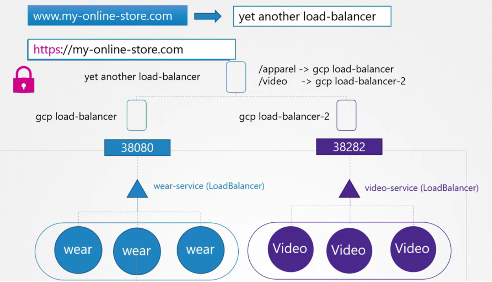
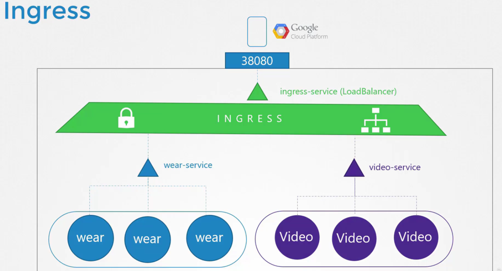
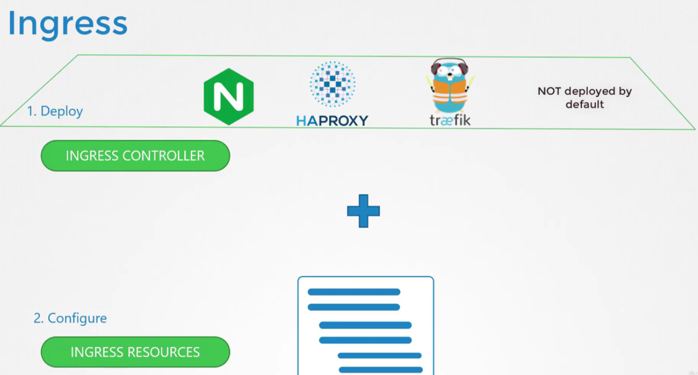
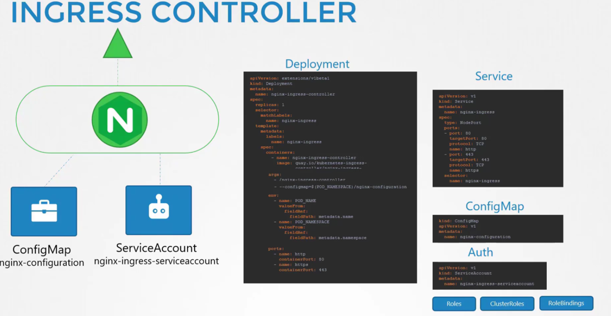
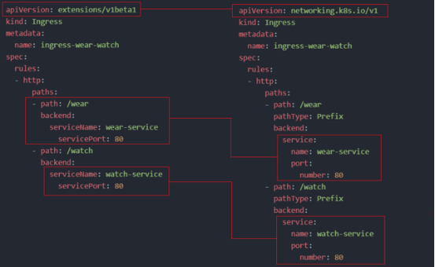

# Ingress

  - Take me to [Lecture](https://kodekloud.com/topic/ingress/)

In this section, we will take a look at **Ingress**

- Ingress Controller
- Ingress Resources

## installazione di un Ingress su un public cloud provider

Questo è quel che avviene quando chiedo la creazione di un service di tipo LoadBalancer a un 
Public Cloud Provider. K8s automaticamenta fa la richiesta al gcp di turno che deploya un NLB
che bilancia il traffico dalla porta web del balancer alla porta dove son esposti i vari NodePort
dei vari nodi del cluster k8s.

Naturalmente questo non è sostenibile se ho diversi siti su diversi context-root, perché ognuno avrebbe il suo 
network load balancer, che andrebbe pagato a parte, facendo lievitare la bolletta. 
Ecco perché ci serve un oggetto fatto apposta per esporre il solo traffico Web, che è l'Ingress.



Pensiamo all'Ingress come un L7 Load Balancer, deployato all'interno del cluster k8s che può esser 
deployato utilizzando i file manifest di k8s e si occupa dei vari aspetti inclusa la configurazione
SSL, il load balancing, ecc ecc.

Devi sempre richiedere un service LoadBalancer, ma rimane unico e da la entra tutto il traffico di tipo WEB.



L'igress è costituito da due parti, un Ingress Controller, installabile attraverso delle soluzioni
di terze parti e non presente di default e una serie di risorse k8s di configurazione.



## Ingress Controller

- Deployment of **Ingress Controller**, in questo caso vederemo nginx, che è supportato e mantenuto da k8s.

Questi sono i principali componenti: 



## ConfigMap

Configurazioni dell'ingress controller come log, keep-alive, ssl-configurations ecc ecc

```
kind: ConfigMap
apiVersion: v1
metadata:
  name: nginx-configuration
```

## Deployment

Necessario fornire la cm, POD_NAME e POD_NAMESPACE come env variable e le porte da esporre.

```
apiVersion: apps/v1
kind: Deployment
metadata:
  name: ingress-controller
spec:
  replicas: 1
  selector:
    matchLabels:
      name: nginx-ingress
  template:
    metadata:
      labels:
        name: nginx-ingress
    spec:
      serviceAccountName: ingress-serviceaccount
      containers:
        - name: nginx-ingress-controller
          image: quay.io/kubernetes-ingress-controller/nginx-ingress-controller:0.21.0
          args:
            - /nginx-ingress-controller
            - --configmap=$(POD_NAMESPACE)/nginx-configuration
          env:
            - name: POD_NAME
              valueFrom:
                fieldRef:
                  fieldPath: metadata.name
            - name: POD_NAMESPACE
              valueFrom:
                fieldRef:
                  fieldPath: metadata.namespace
          ports:
            - name: http
              containerPort: 80
            - name: https
              containerPort: 443
```

## ServiceAccount

- ServiceAccount require for authentication purposes along with correct Roles, ClusterRoles and RoleBindings.

- Create a ingress service account
```
$ kubectl create -f ingress-sa.yaml
serviceaccount/ingress-serviceaccount created
```

## Service Type - NodePort

```
# service-Nodeport.yaml

apiVersion: v1
kind: Service
metadata:
  name: ingress
spec:
  type: NodePort
  ports:
  - port: 80
    targetPort: 80
    protocol: TCP
    name: http
  - port: 443
    targetPort: 443
    protocol: TCP
    name: https
  selector:
    name: nginx-ingress
```

- Create a service
```
$ kubectl create -f service-Nodeport.yaml
```
- To get the service

```
$ kubectl get service
```

## Ingress Resources

Nella risorsa di tipo Ingress, quel che facciamo è definire il modo in cui vogliamo redirigere il
traffico, indicando una serie di **regole**. 

P.es., in funzione dell'url, possiamo dire di redirigere ad un'app piuttosto che ad un'altra (
nel caso si parla di redirigere verso il Service ClusterIP), idem possiamo farlo p.es. in funzione
del dominio stesso (o sottodominio meglio) o entrambe le regole combinate insieme, 
quindi in funzione del dominio e poi anche del singolo context root (path) del singolo sottodominio.
Quello che facciamo è indicare poi `serviceName` e `servicePort` dove redirigere il traffico
per ogni foglia, indicando quello che viene chiamato `backend specification`

E' anche possibile definire un default service, che è il service che viene invocato, laddove nessuno
delle regole definite è soddisfatta. Nel caso è necessario rendere disponibile tale servizio.

```
Ingress-wear.yaml

apiVersion: extensions/v1beta1
kind: Ingress
metadata:
  name: ingress-wear
spec:
     backend:
        serviceName: wear-service
        servicePort: 80
```

- To create the ingress resource
```
$ kubectl create -f Ingress-wear.yaml
ingress.extensions/ingress-wear created
```

- To get the ingress
```
$ kubectl get ingress
NAME           CLASS    HOSTS   ADDRESS   PORTS   AGE
ingress-wear   <none>   *                 80      18s
```

## Ingress Resource - Rules

- 1 Rule and 2 Paths. Una regola sull'unico dominio esposto, dove si definiscono diversi servizi
su cui redirigere la richiesta, in funzione del path richiesto.

```
apiVersion: extensions/v1beta1
kind: Ingress
metadata:
  name: ingress-wear-watch
spec:
  rules:
  - http:
      paths:
      - path: /wear
        backend:
          serviceName: wear-service
          servicePort: 80
      - path: /watch
        backend:
          serviceName: watch-service
          servicePort: 80
```
- Describe the earlier created ingress resource. Default backend è il fallback quando nessuna regola è 
soddisfatta.

```
$ kubectl describe ingress ingress-wear-watch
Name:             ingress-wear-watch
Namespace:        default
Address:
Default backend:  default-http-backend:80 (<none>)
Rules:
  Host        Path  Backends
  ----        ----  --------
  *
              /wear    wear-service:80 (<none>)
              /watch   watch-service:80 (<none>)
Annotations:  <none>
Events:
  Type    Reason  Age   From                      Message
  ----    ------  ----  ----                      -------
  Normal  CREATE  23s   nginx-ingress-controller  Ingress default/ingress-wear-watch

```

- 2 Rules and 1 Path each. In questo caso, abbiamo 2 regole e son applicate in funzione del dominio. 

  Il dominio è definito nel campo `host` della rule

```
# Ingress-wear-watch.yaml

apiVersion: extensions/v1beta1
kind: Ingress
metadata:
  name: ingress-wear-watch
spec:
  rules:
  - host: wear.my-online-store.com
    http:
      paths:
      - backend:
          serviceName: wear-service
          servicePort: 80
  - host: watch.my-online-store.com
    http:
      paths:
      - backend:
          serviceName: watch-service
          servicePort: 80
```
 
## Creare Ingress in maniera imperativa (da 1.20+)

Now, in k8s version 1.20+ we can create an Ingress resource from the imperative way like this:

`kubectl create ingress <ingress-name> --rule="host/path=service:port"`

P.es.: `kubectl create ingress ingress-test --rule="wear.my-online-store.com/wear*=wear-service:80"`

## Variazioni da 1.20+ per definizione regole



## Annotation di rewrite-target

Praticamente, quel che succede è che senza questa annotation, se il path della richiesta
che arriva all'ingress controller è /wear, così viene trasferita al servizio destinazione.

Al contrario, con rewrite-target, quel che facciamo è far arrivare la richiesta come se
arrivasse sulla root, perché magari la singola applicazione che noi abbiamo deployato sul
cluster, non è pensata per avere un context-root particolare, ma per vivere autonomamente
e quindi con /wear otterremo 404. 

In questo modo, quando il client chiama l'ingress su: 
`http://<ingress-service>:<ingress-port>/watch` viene traddotto in `http://<watch-service>:<port>/`
senza il rewrite target avremmo: 
`http://<ingress-service>:<ingress-port>/wear` --> `http://<wear-service>:<port>/wear`

```
apiVersion: networking.k8s.io/v1
kind: Ingress
metadata:
  name: minimal-ingress
  annotations:
    nginx.ingress.kubernetes.io/rewrite-target: /
spec:
  ingressClassName: nginx-example
  rules:
  - http:
      paths:
      - path: /testpath
        pathType: Prefix
        backend:
          service:
            name: test
            port:
              number: 80
```

#### References Docs

- https://kubernetes.io/docs/concepts/services-networking/ingress/
- https://kubernetes.io/docs/concepts/services-networking/ingress-controllers/
- https://thenewstack.io/kubernetes-ingress-for-beginners/