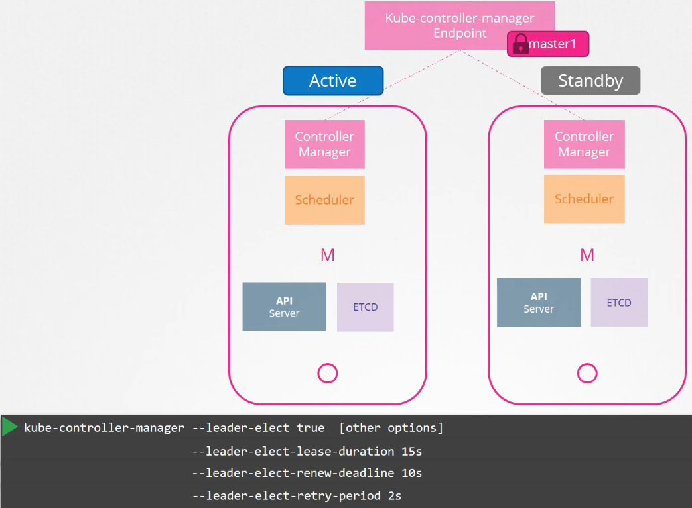

# Choosing a HA

  - Take me to [Lecture](https://kodekloud.com/topic/configure-high-availability/)

In una configurazione in HA, quel che accade è che: 

- Poniamo un LB davanti all'API Server, per bilanciare le richieste. I due API Server
son in una configurazione active-active:

- Controller Manager e Scheduler, hanno invece una configurazione Active-Standby, 
in quanto se funzionassero insieme, ossia 2 Controller Manager o 2 Scheduler, si potrebbero creare diversi
problemi. Si regolano quindi creando un leader, tramite un processo di election

- ETCD, solitamente si mette su nodi separati e l'api server, che è l'unico che parla con l'etcd, 
ha infatti l'elenco degli indirizzi a cui puntare per chiamarlo. Anche questi son active-active
- Altro setup e lo stacked, dove l'etcd sta nello stesso nodo del master, con il resto della control plane

