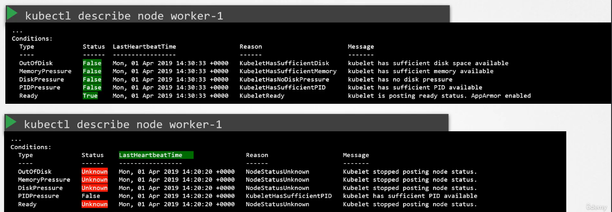

# Worker Node Failure

  - Take me to the [Lecture](https://kodekloud.com/topic/worker-node-failure/)

  - Lets check the status of the Nodes in the cluster, are they **`Ready`** or **`NotReady`**

    ```
    kubectl get nodes
    ```

  - If they are **`NotReady`** then check the **`LastHeartbeatTime`** of the node to find out the time when node might have crashed

    ```
    kubectl describe node worker-1
    ```
    
    Ci sono i vari flag per saturazione disco, saturazione memoria centrale, livello critico di quantità di disco
    libero o numero di processi troppo alto.

    Inoltre, se il worker non è in grado di comunicare con il master, lo stato del nodo è unknowkn.

    


  - Check the possible **`CPU`** and **`MEMORY`**  using **`top`** and **`df -h`** 

    


  - Check the status and the logs of the **`kubelet`** for the possible issues.

    ```
    service kubelet status
    ```

    ```
    sudo journalctl –u kubelet
    ```
    
  
    
  - Check the **`kubelet`** Certificates, they are not expired, and in the right group and issued by the right CA.

    ```
    openssl x509 -in /var/lib/kubelet/worker-1.crt -text
    ```

    


