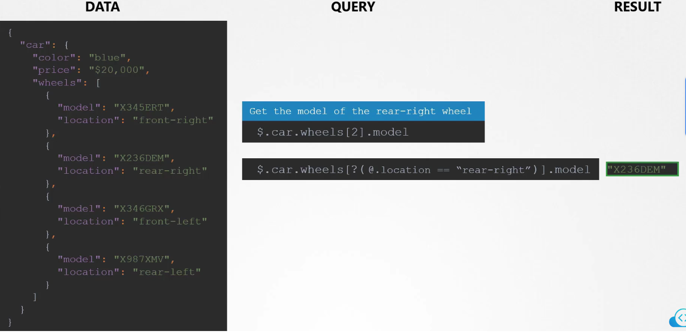
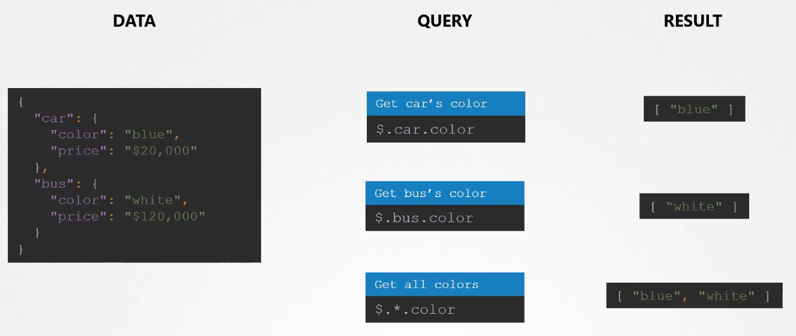

# Pre-requisite for JSON PATH

  - I want to know more about JSON PATH and its [Pre-requisite](https://kodekloud.com/topic/pre-requisites-json-path/)  

## Piccoli appunti

dictionary: 
```
- cane:
    taglia: 
    anno:
```
lista:
```
cani: 
- labrador
- collie
- bassotto
```

Per la query:

- $ è il root del JSON document
- puoi navigare il json con `$.<elemento>.<elemento>` ecc ecc
- per prendere l'imo elemento di un array usi le quadre come sempre `$.car.models[2].year`
- per applicare condizioni: `$[?(@ > 40)]` (prendi gli elementi nella lista maggiori di 40)
  - @ significa il singolo elemento
  - ? per specificare il criterio
  - condizioni: 
    - >, in, nin(not in), ==, !=
- anche condizioni più fini, p.es selezioniamo in funzione del valore della location (@.location == "rear-right")
  - $.status.containerStatuses[?(@.name == "redis-container")].restartCount




- Inoltre, possiamo anche dire, qualsiasi, con il solito *, quindi p.es. `$.*.model`, oppure, tutti gli elementi
dell'array con `$.car.wheels[*].model`, inoltre, gli elementi dal primo al quarto `$[0:3]`, l'ultimo elemento
è inoltre `$[-1:]`, oppure gli ultimi 3 `$[-3:]`



Anche possibile effettuare dei loop con degli a capo ad ogni elemento


Possibile anche sortare i risultati di kubectl, secondo quanto ritornato dal formato json: 

```
controlplane ~ ➜  k get pv --sort-by=.spec.capacity.storage
NAME       CAPACITY   ACCESS MODES   RECLAIM POLICY   STATUS      CLAIM   STORAGECLASS   REASON   AGE
pv-log-4   40Mi       RWX            Retain           Available                                   14m
pv-log-1   100Mi      RWX            Retain           Available                                   14m
pv-log-2   200Mi      RWX            Retain           Available                                   14m
pv-log-3   300Mi      RWX            Retain           Available                                   14m
```

Inoltre, possibile anche creare custom columns come queste:

```
kubectl get pv --sort-by=.spec.capacity.storage -o=custom-columns=NAME:.metadata.name,CAPACITY:.spec.capacity.storage > /opt/outputs/pv-and-capacity-sorted.txt
```